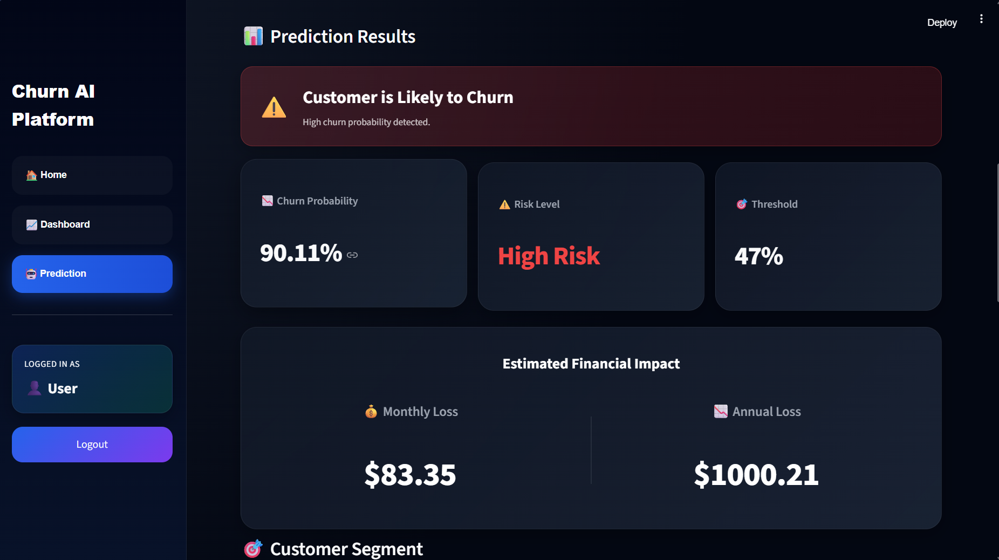
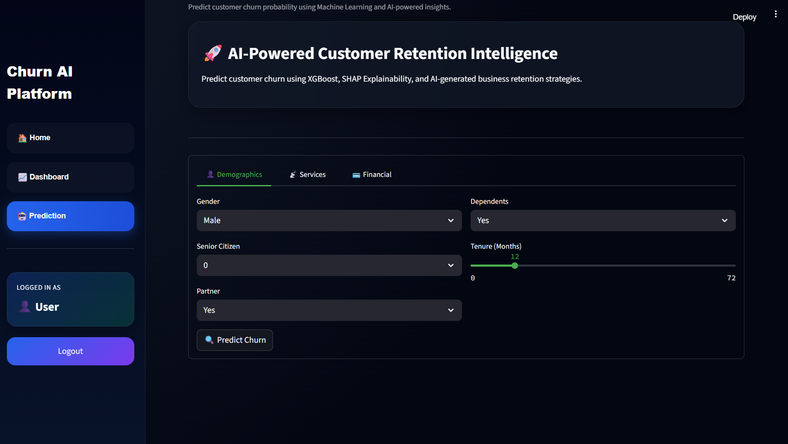
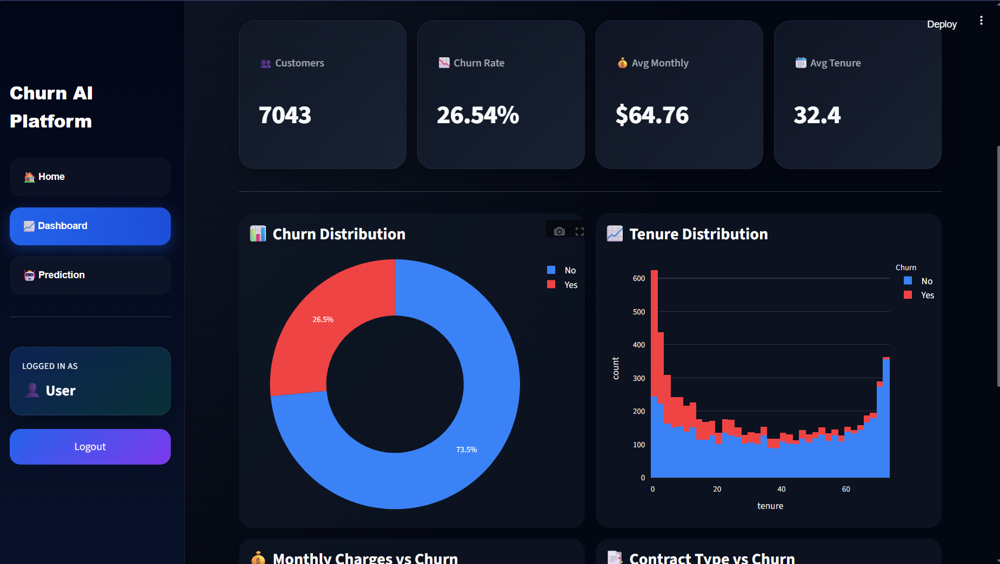
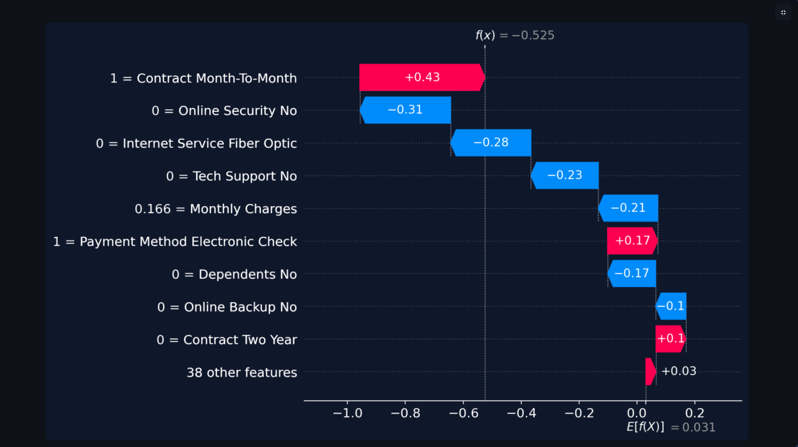
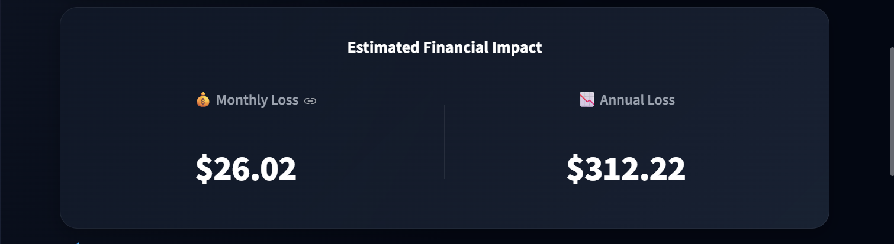
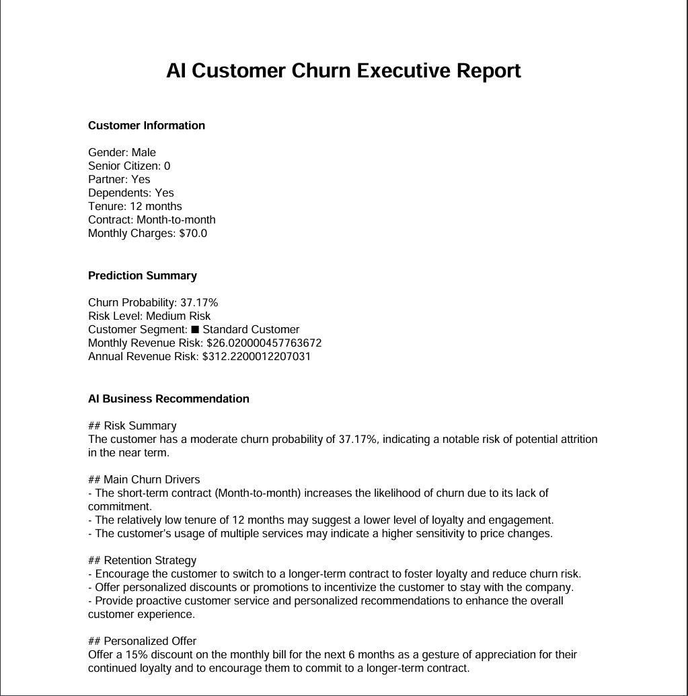
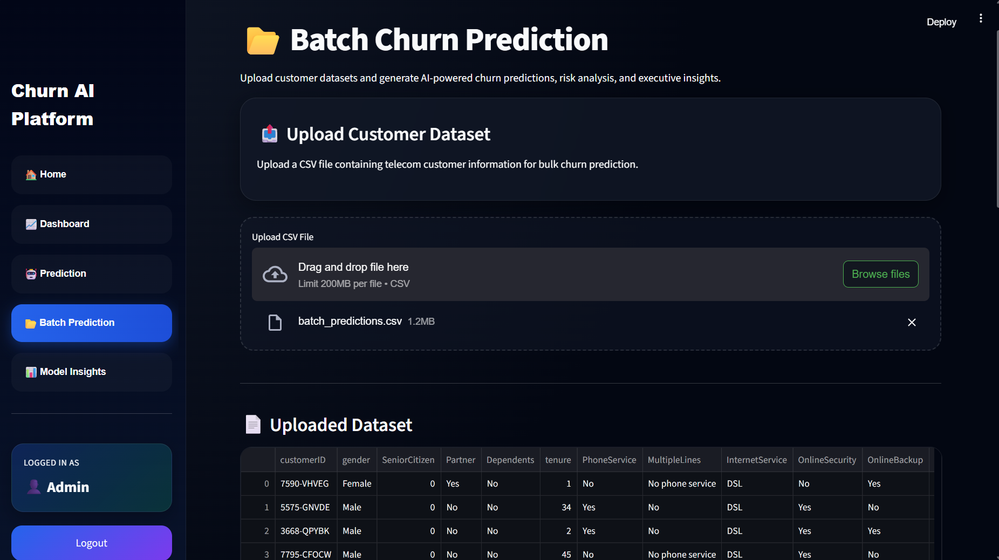
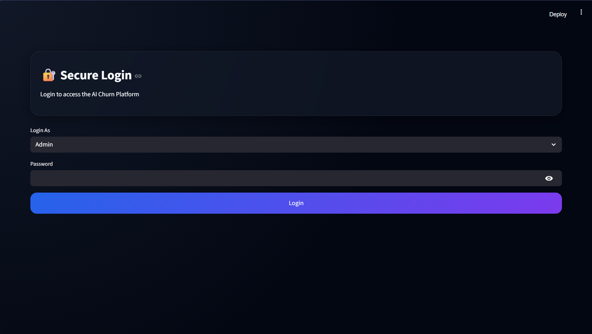

# 🚀 AI-Powered Customer Churn Intelligence Platform




Enterprise-grade AI platform for predicting customer churn, analyzing business risk, generating AI-powered retention strategies, and delivering executive analytics through an interactive SaaS-style dashboard.

---

## 🌍 Live Demo

🚧 Deployment Coming Soon

---

## 🌟 Overview

This project is an advanced end-to-end Customer Churn Intelligence System built using:

- Machine Learning
- Explainable AI (SHAP)
- AI Business Recommendations
- Revenue Risk Analytics
- Executive PDF Reporting
- Role-Based Authentication
- Enterprise UI/UX

The platform helps businesses:

- predict customer churn
- identify high-risk customers
- estimate financial impact
- generate retention strategies
- analyze churn behavior visually

---

## 🧠 Key Features

## 🤖 AI-Powered Churn Prediction



- XGBoost classification model
- optimized churn threshold
- real-time predictions
- probability-based risk analysis

## 📊 Enterprise Analytics Dashboard



- churn distribution
- tenure analysis
- contract analytics
- feature importance
- KPI metrics

## 🔍 SHAP Explainability



- waterfall plots
- feature contribution analysis
- transparent AI decisions

## 💰 Revenue Risk Estimation



- monthly revenue risk
- annual revenue risk
- customer financial impact estimation

## 🎯 Customer Segmentation Engine

- High Value Customer
- Loyal Customer
- At Risk Customer
- Low Engagement Customer
- New Customer

## 🧠 AI Executive Insights

- churn analysis
- retention strategy
- executive business insights

## 📄 Executive PDF Reports



- single prediction reports
- batch analytics reports

## 📂 Batch Prediction System




- CSV upload prediction
- bulk churn analysis
- AI executive insights
- downloadable results

## 🔐 Authentication & RBAC



- Admin
- Analyst
- User
- Viewer

---

## 🖥️ Tech Stack

## Frontend

- Streamlit
- Custom CSS
- Plotly

## Machine Learning

- XGBoost
- Scikit-learn
- SHAP
- Pandas
- NumPy

## AI Integration

- OpenAI API
- OpenRouter

## Reporting

- ReportLab PDF Generation

---

## 📁 Project Structure

```text
Customer-Churn-Platform/
│
├── app/
│   ├── pages/
│   ├── assets/
│   ├── app.py
│   ├── Home.py
│   ├── auth.py
│   ├── config.py
│   └── utils.py
│
├── data/
├── models/
├── images/
├── requirements.txt
├── train.py
└── README.md
```

---

## 📊 Workflow

```text
Customer Input
      ↓
ML Prediction
      ↓
Risk Analysis
      ↓
Revenue Estimation
      ↓
Customer Segmentation
      ↓
AI Recommendations
      ↓
SHAP Explainability
      ↓
Executive PDF Export
```

---

## 📈 Model Performance

| Metric    | Score |
|-----------|-------|
| Accuracy  | 72.5% |
| Recall    | 80%   |
| F1 Score  | 60.7% |
| ROC-AUC   | 0.836 |


---

## 💼 Business Impact

This platform enables organizations to:

- reduce customer churn
- estimate revenue loss
- improve customer retention
- automate executive reporting
- prioritize high-value customers

---

## 🚀 Installation

## Clone Repository

```bash
git clone https://github.com/your-username/customer-churn-platform.git

cd customer-churn-platform
```

## Install Dependencies

```bash
pip install -r requirements.txt
```

## Add Environment Variables

Create `.env`

```env
OPENROUTER_API_KEY=your_api_key
```

## Run Application

```bash
streamlit run app/app.py
```

---

## 👨‍💻 Author

Developed by **Nandan**

AI + ML + Enterprise Analytics + SaaS UI Engineering

---

## ⭐ Final Portfolio Statement

This project demonstrates:

- Machine Learning Engineering
- Explainable AI
- Business Intelligence
- Revenue Analytics
- Enterprise Dashboard Design
- AI Integration
- Full Stack Streamlit Development

to create a production-style Customer Retention Intelligence Platform.
